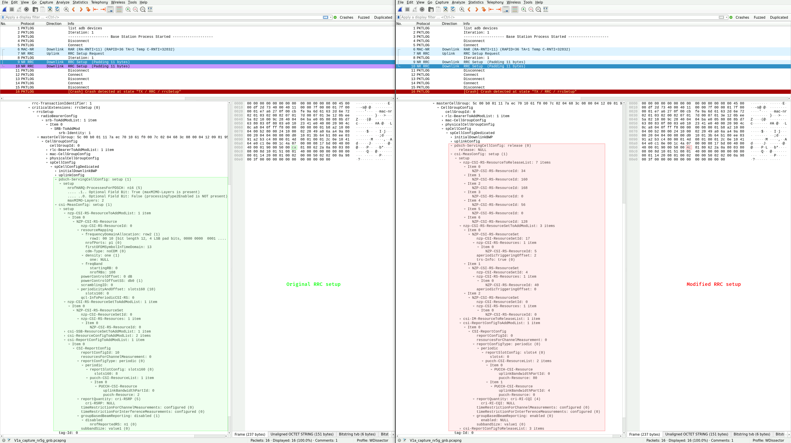
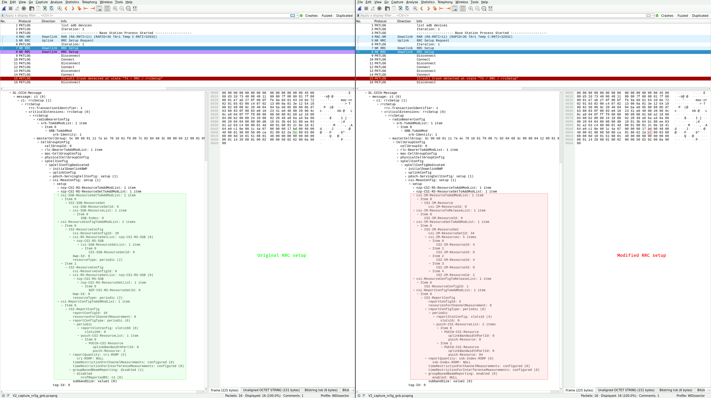

| Title             | Transient Denial of Service Vulnerabilities in MediaTek Dimensity 1080/7050 (MT6877)'s 5G Baseband |
| ----------------- | -------------------------------------------------------------------------------------------------- |
| Affected Product  | MediaTek Dimensity 1080/7050 (MT6877) system-on-chip (SoC) with integrated 5G baseband             |
| Affected Firmware | `MOLY.NR15.R3.TC8.PR5.SP.V5.P141` (older versions may also be affected)                            |
| CVE ID            | [CVE-2025-20792](https://www.cve.org/CVERecord?id=CVE-2025-20792)                                  |
| Vendor Website    | [https://www.mediatek.com](https://www.mediatek.com)                                               |
| Identified in     | July 2025                                                                                          |
| Identified by     | IoT Lab, University of Applied Sciences Upper Austria, Campus Hagenberg                            |
| Website           | [https://www.fh-ooe.at/si/](https://www.fh-ooe.at/si/)                                             |
| Team              | Denis Krämer B.Sc., Dieter Vymazal M.Sc., DI Markus Zeilinger                                      |
| Contact           | Denis Krämer <br> <denis.kraemer@students.fh-hagenberg.at> <br> 7B5B 5FCD 14A2 4A20 C43A A6D0 8B78 FC61 E205 BE39 |

## Vendor Description

*"MediaTek designs and develops advanced system-on-chip (SoC) solutions for mobile devices, home entertainment, connectivity, and IoT (Internet of Things) products. [...]"*

Source: [https://www.mediatek.com/company/discover](https://www.mediatek.com/company/discover)

## Overview

During the 5G NR initial attachment procedure, unauthenticated radio resource control (RRC) messages are used to set up a connection between the baseband and a base station (gNB) of the 5G mobile network. By modifying downlink RRC setup messages in a specific manner, several reachable assertions and fatal errors in the baseband firmware of the MediaTek Dimensity 1080 (rebranded as Dimensity 7050) can be triggered, each of which result in an exception and restart of the modem. Consequently, the mobile network connection of the Xiaomi Redmi Note 12 Pro+ smartphone (which uses this SoC) becomes temporarily unavailable, and the modem keeps restarting until the transmission of the modified RRC packets via the gNB is stopped. This classifies each of the vulnerabilities as transient DoS.

## Impact

An attacker can use a malicious gNB to send modified RRC setup messages to nearby MediaTek basebands and continuously trigger a modem reset, which results in a loss of mobile network connectivity for these subscribers until the attack is stopped. The attack requires no knowledge of any confidential information stored on the universal integrated circuit cards (UICCs) of the targets, because the RRC setup message is sent by the network to the baseband before any mutual authentication (5G-AKA) is performed. Only the mobile country code (MCC) and mobile network code (MNC) of the target's network is required to successfully execute such an attack. Since the [ITU-T assigns and publishes the MCC/MNC of public networks](http://handle.itu.int/11.1002/pub/82153a48-en), and only a handful of them exist per country, we argue that this requirement adds little complexity to the attack. Moreover, while the attack requires physical proximity to the target, it requires no interaction on behalf of the user.

## Proof of concept

In the following proof of concept (PoC) video for vulnerability V1, a modified RRC setup message is sent to the baseband upon connecting to a malicious nearby gNB. An exception in the firmware is triggered and the modem restarts, which can be verified by the Android Debug Bridge (adb) logs of the smartphone. The adb logs contain further information about the location of the exception. Moreover, a temporary loss of connectivity of the Android smartphone can be observed.

<video controls muted preload><source src="/mediatek_mt6877_baseband_vulnerabilities/assets/videos/V1_poc_exploit_2x.mp4" type="video/mp4"></video>

## Reproduction

We used the [5Ghoul packet interception API](https://github.com/asset-group/5ghoul-5g-nr-attacks#4--create-your-own-5g-exploits-test-cases) to write test cases that modify downlink traffic and trigger the vulnerabilities, but any toolset capable of performing such modifications is suitable to execute the attacks. We then used an RF shielded test environment comprised of a software-defined radio (SDR) and the affected user equipment (UE) to transmit modified RRC setup messages to the baseband. The traffic captured on the NR-Uu interface while triggering the vulnerabilities is shown in the provided Wireshark screenshots, which each depict the original RRC message on the left-hand side (not sent to the baseband) and the modified RRC message on the right-hand side (sent to the baseband). Finally, we observed several modem exceptions by inspecting the adb logs of the smartphone.

## Vulnerability V1: invalid pdsch-ServingCellConfig and csi-MeasConfig setup ([CVE-2025-20792](https://www.cve.org/CVERecord?id=CVE-2025-20792))

Triggering vulnerability V1 results in the following adb log entry:

```
[Fatal error(MPU_NOT_ALLOW)] err_code1:0x0000001D err_code2:0x90FE3166 err_code3:0x00000000
```

To reproduce this issue, starting from the MAC-NR layer, change the byte at offset 123 of a valid RRC setup message to any of the following values: `{0x42}` or `{0x4c}`, e.g. `{0x4c}` (as shown in figure 1). This corresponds to changing the 1st and 2nd byte of the `pdsch-ServingCellConfig` field inside the RRC payload, e.g. to `{0x09, 0x90}`. According to Wireshark, this changes its `setup` into a `release` field. Moreover, this modification alters several of the configuration lists contained in the subsequent `csi-MeasConfig setup` field.

<details>
<summary>Figure 1: Comparison of the original and modified RRC setup message for vulnerability V1 in Wireshark (click to show).</summary>

</details>

Note: vulnerability V1 can also be triggered by changing the byte at offset 128 of a valid RRC setup message to the value `{0xe0}`.

## Vulnerability V2: invalid csi-MeasConfig setup ([CVE-2025-20792](https://www.cve.org/CVERecord?id=CVE-2025-20792))

Triggering vulnerability V2 results in the following adb log entry:

```
[Fatal error(MPU_NOT_ALLOW)] err_code1:0x0000001D err_code2:0x90FE3088 err_code3:0x00000000
```

To reproduce this issue, starting from the MAC-NR layer, change the byte at offset 128 of a valid RRC setup message to the value `{0xe1}` (as shown in figure 2). This corresponds to changing the 2nd and 3rd byte of the `csi-MeasConfig setup` field inside the RRC payload, e.g. to `{0x5c, 0x30}`. According to Wireshark, this alters the type of the therein contained `csi-SSB-ResourceSetToAddModList`, `csi-ResourceConfigToAddModList` and `csi-ReportConfigToAddModList` fields or changes their contents to invalid values.

<details>
<summary>Figure 2: Comparison of the original and modified RRC setup message for vulnerability V2 in Wireshark (click to show).</summary>

</details>

Note: triggering vulnerability V2 results in a different `err_code2` compared to vulnerability V1.

## Vulnerabilities V3 - V11

We identified 9 additional vulnerabilities which were marked as duplicates by MediaTek. Once they have been publicly disclosed, we will update this section with further details.

## Affected Product and Firmware

The following product and firmware were tested and found to be affected by the vulnerabilities:

* Smartphone: Xiaomi Redmi Note 12 Pro+ (MediaTek Dimensity 1080/7050 [MT6877] with integrated 5G baseband)
* Firmware: Android 14, OS version: `1.0.16.0.UMOEUXM`, Build: `UP1A.231005.007`, Patch level: 2025-04-01, Baseband version: `MOLY.NR15.R3.TC8.PR5.SP.V5.P141` (older versions may also be affected)

SHA-256 hash of the affected baseband firmware image (bundled by Xiaomi):
```
1170c9646450d25bd7263ab32a0c7df04d2a1a9c9b57fe1e6d4e572fa699b99c  md1img.img
```

## Solution

MediaTek identified a common root cause for the vulnerabilities V1 - V2 and publicly disclosed the issue as part of their [December 2025 Product Security Bulletin](https://corp.mediatek.com/product-security-bulletin/December-2025). Moreover, MediaTek stated that they have released updated baseband firmware which fixes these vulnerabilities. MediaTek recommends that users reach out to their device original equipment manufacturer (OEM) if they would like to confirm which baseband firmware version includes the patch.

## Vendor Statement

The vendor has requested to include the following official statement by Tiger Hsu, [Product Security](https://corp.mediatek.com/security-announcement) Officer at MediaTek, in the public release of these vulnerabilities:

*"Security and user protection remain top priorities for all MediaTek platforms. In response to the cellular baseband modem vulnerabilities identified by researchers from IoT-Lab-FH-OOE (University of Applied Sciences Upper Austria/Secure Information Systems/IoT-Lab), we have worked closely with our partners to validate the issues and provide timely patches to all affected ODM/OEM customers. At this time, we have no evidence that these vulnerabilities are being actively exploited in the wild. We strongly encourage users to keep their devices updated with the latest security patches."*

## Communication Timeline

| Date       | Sender       | Description |
| ---------- | ------------ | ----------- |
| 2025-08-04 | Denis Krämer | Contacted MediaTek using their PGP public key and attached the vulnerability report. |
| 2025-08-08 | -            | Received information that the mail has been rejected by MediaTek's mail server due to its size. |
| 2025-08-08 | Denis Krämer | Provided the vulnerability report in two chunks. |
| 2025-08-20 | Denis Krämer | Reminded MediaTek of the 90 days disclosure deadline. |
| 2025-09-02 | Denis Krämer | Sent the report again using another mail account, included a statement that 1/3 of the time until disclosure has passed. |
| 2025-09-03 | MediaTek     | Responds that they did not receive any previous mails or attachments, requests upload of attachments to Google Drive. |
| 2025-09-03 | Denis Krämer | Provided the report and screenshots of failed communication attempts via Google Drive. |
| 2025-09-03 | MediaTek     | Acknowledges receipt of the report. |
| 2025-09-08 | MediaTek     | States that the previous mails were incorrectly classified as malicious or phishing attempts. |
| 2025-09-11 | MediaTek     | Asks for clarification regarding the public disclosure date. |
| 2025-09-11 | Denis Krämer | Provided the updated disclosure date (2025-12-02). |
| 2025-09-11 | MediaTek     | Asks how the disclosure will take place and for a draft of the documents, offers to provide an official statement. |
| 2025-09-15 | Denis Krämer | Outlined the form and content of the advisory, offered to include the official statement, asked for updates regarding the vulnerabilities. |
| 2025-09-16 | MediaTek     | States that some of the vulnerabilities were previously reported by another researcher. |
| 2025-09-16 | MediaTek     | Requests a link to the blog where the advisories will be published. |
| 2025-09-16 | Denis Krämer | Provided an example of a previous advisory from IoT-Lab-FH-OOE. |
| 2025-09-17 | MediaTek     | Thanks for the additional information. |
| 2025-09-18 | MediaTek     | Clarifies that the vulnerabilities V3 - V11 have been classified as duplicates. |
| 2025-09-19 | MediaTek     | States that the vulnerabilities V1 - V2 share the same root cause and have received a high severity rating. |
| 2025-09-22 | -            | MediaTek shares the fix for the vulnerabilities V1 - V2 with their OEM partners (according to a statement by MediaTek from 2025-11-25). |
| 2025-09-23 | Denis Krämer | Requested the CVE IDs and provided the information for the acknowledgements page. |
| 2025-09-25 | MediaTek     | Acknowledges the information, states that CVE IDs for duplicate findings will be available after their public disclosure. |
| 2025-10-14 | MediaTek     | Assigns CVE-2025-20792 for the vulnerabilities V1 - V2, plans to release a patch and disclose them after an additional two months. |
| 2025-10-16 | Denis Krämer | Inquired whether CVE-2025-20792 will be included in MediaTek's December 2025 product security bulletin. |
| 2025-10-16 | MediaTek     | Clarifies that CVE-2025-20792 will be included in their December 2025 product security bulletin. |
| 2025-11-06 | MediaTek     | Provides an official statement to be included in the advisory, requests a draft before public release. |
| 2025-11-07 | Denis Krämer | Confirmed that MediaTek will receive a draft before release, asked for the firmware version that fixes CVE-2025-20792. |
| 2025-11-07 | MediaTek     | States that it cannot share this information. |
| 2025-11-24 | MediaTek     | Asks for a draft of the advisory again, clarifies that the vulnerabilities are reachable assertions that only lead to DoS. |
| 2025-11-24 | Denis Krämer | Provided a draft of this advisory. |
| 2025-11-25 | MediaTek     | Clarifies that it has no control over the firmware version string that different OEMs may use and thus cannot provide the information I requested before. |
| 2025-11-25 | Denis Krämer | Clarified that I want end-users to be able to verify if they are running a firmware version that contains fixes for these issues. Asked if MediaTek wants to provide an alternative text for the *Solution* section. |
| 2025-11-25 | MediaTek     | Provides an alternative text for this section. |
| 2025-11-25 | Denis Krämer | Incorporated the changes from MediaTek, asked if they greenlight the resulting text. |
| 2025-11-25 | MediaTek     | States that they are okay with the revised text. |
| 2025-11-25 | MediaTek     | States that they have shared a fix for CVE-2025-20792 with their OEM partners on 2025-09-22. |
| 2025-11-25 | Denis Krämer | Replied that I have included this information in the timeline. |
| 2025-11-26 | MediaTek     | Asks to share the updated version of the advisory. |
| 2025-11-26 | Denis Krämer | Provided the revised draft of the advisory. |
| 2025-11-26 | MediaTek     | Thanks for the additional information. |
| 2025-12-01 | -            | MediaTek releases their December 2025 security bulletin. |
| 2025-12-01 | Denis Krämer | Asked to correct the credit information for CVE-2025-20792 on their acknowledgements page, since it was missing a word (the location of my university). |
| 2025-12-01 | MediaTek     | Stated that the credit information was updated. |
| 2025-12-01 | Denis Krämer | Asked to verify if the update was successful, since it still showed the old information. |
| 2025-12-01 | -            | The credit information was corrected. |
| 2025-12-02 | MediaTek     | Stated that the credit information was already updated. |

## Version History

| Date       | Version | Changes                                    |
| ---------- | ------- | ------------------------------------------ |
| 2025-11-24 | v0.1    | Initial draft                              |
| 2025-11-25 | v0.2    | Incorporated changes from MediaTek         |
| 2025-11-26 | v0.3    | Cosmetic changes                           |
| 2025-12-01 | v0.4    | Updated timeline                           |
| 2025-12-02 | v1.0    | Initial release of vulnerabilities V1 - V2 |